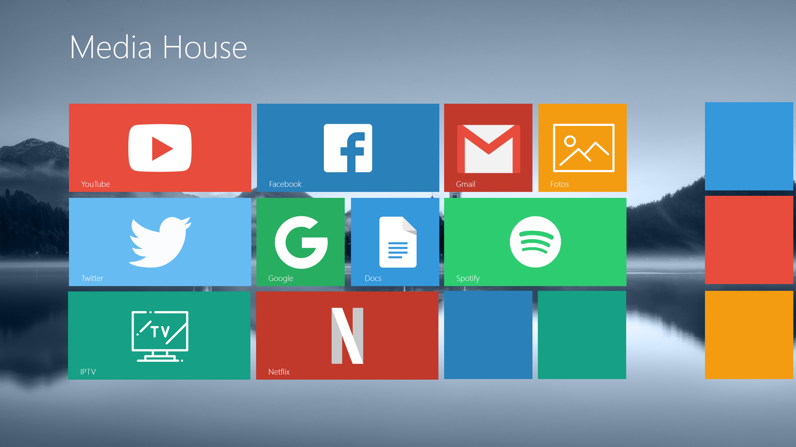

# Media House
**É um Prototipo (em JPG e PSD)** que criei, **para layout do "Media House"**, que é aplicação desenvolvida para Desktop multimidia, **inspirada no tema do Windows Metro**, com usabilidade pensada em monitores com grandes resoluções e smart tv.

## Protótipo

***

>O Projeto do Media House é uma criação de Douglas Volkart

Para acessar o aplicativo Media House, [clique aqui](https://github.com/douglasvolkart/my-media-house)!
