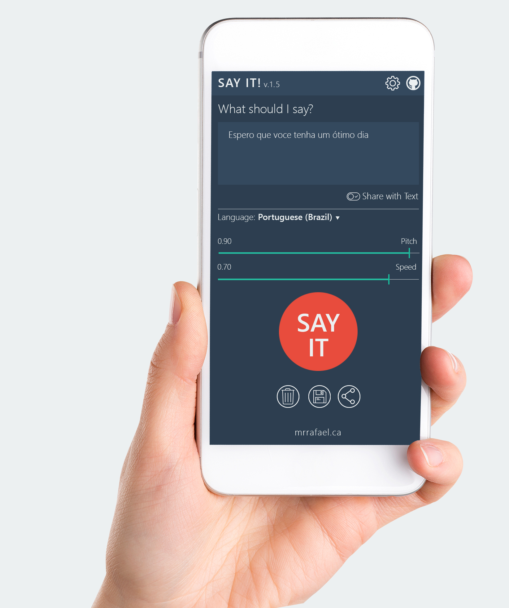
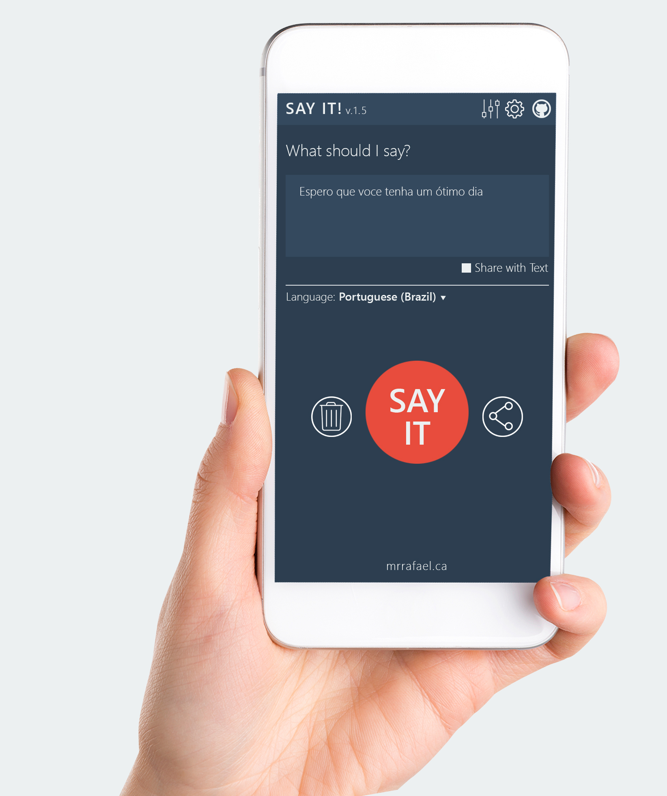

# Say It - Fala ai
**É um Prototipo (em JPG e PSD)** que criei, **para layout do "Say It" (em inglês) ou "Fala ai" (em Português)**, que é uma aplicação desenvolvida para Smartphone Android, **inspirada no Design UI** e planejado também com **Design UX**.

## Protótipo

Abaixo os layouts desenhados para a nova versão do aplicativo.

### Com botão save

### Sem botão save

***

>O Projeto do Say It é uma criação de Rafael Passarela

Para acessar o aplicativo Say It no GitHub, [clique aqui](https://github.com/rafaelpassarela/say-it-text-to-speech)

Para download do aplicativo Say It no Google Play, [clique aqui](https://play.google.com/store/apps/details?id=ca.mrrafael.sayit_text_to_speech)
